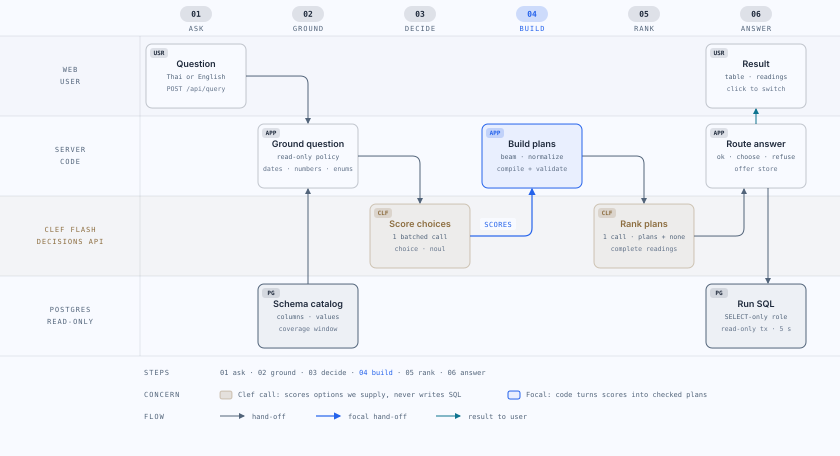

# Decision SQL: text-to-SQL over Olist with a decision model

## Overview

Two experimental question-answering workspaces use Clef Flash decisions and deterministic, read-only PostgreSQL compilers: Olist e-commerce and synthetic utility meters. Switch workspaces in the browser; open `/#meter` for meters.

## Synthetic meter workspace

The meter harness supports usage totals, ranking, period comparisons, daily anomalies, stale reporting, measured change contributors, conversational follow-ups and multi-query summaries. It retains a validated plan in a bounded server-owned conversation store. Answers include SQL evidence, coverage warnings and a frozen clock; cumulative counter resets, invalid readings and missing intervals are handled explicitly.

```sh
npm install
npm run db:up
npm run meter:import
npm run build
npm start
```

Set `OPENROUTER_KEY` in `.env`, then open http://localhost:4317/#meter. The fixture contains 15 synthetic meters and 33,439 readings, anchored at 2026-10-09 12:00 Asia/Bangkok. It is not connected to a real facility. Cloudflare-only routing and disabled provider fallbacks are preserved.

Validation on the integrated code: 147 tests passed with `METER_DB_TEST=1 npm test`, build passed, and the actual Cloudflare harness passed 17/17 English/Thai regression cases. These are regression results, not an independent generalization benchmark. Physical causes of spikes remain unknown; the harness reports measured contributors. See [meter harness](docs/meter-harness.md) and [evaluation evidence](docs/meter-validation.json).

[Text2SQL-Decisions on Hugging Face](https://huggingface.co/datasets/Chulinz/Text2SQL-Decisions) includes a separate English-only `meter` configuration with 3,081 synthetic examples, alongside 25,000 default SQL-plan-selection examples. The contracts differ; do not concatenate them unchanged. Run `npm run meter:dataset` to generate meter decisions locally. See [dataset documentation](docs/meter-dataset.md).

## Olist workspace

The original workspace covers the public Kaggle Olist Brazilian e-commerce dataset (2016 to 2018). A user asks a question in Thai or English. Cloudflare Clef Flash, called through the OpenRouter Decisions API, scores a fixed set of multiple-choice questions about it. Code turns those scores into complete candidate query plans, compiles each plan into parameterized PostgreSQL, and asks Clef once more to rank the candidates. The web app shows the result rows, the SQL and parameters, the interpretation in plain Thai, other plausible interpretations and the decision probabilities.

The model never writes SQL. Every query is produced by a deterministic compiler from a typed plan and runs read-only.

## Architecture



### Request pipeline

1. **Read-only policy.** Questions phrased as data modification (delete, update, insert, drop, and Thai equivalents) are refused before planning, with zero model calls. This is a security policy, not an accuracy heuristic.
2. **Semantic catalog.** Built from the introspected schema plus curated Thai/English labels: measures (counts, numeric measures such as item revenue or review score, detail lists per entity), categorical, entity and date dimensions, date anchors (purchase, approval, carrier handoff, delivery, estimated delivery, shipping deadline, review), declared comparable column pairs, and unsupported intents. Each measure has one or more realizations; code picks the root relation that reaches every dimension and filter, so equivalent options are never offered twice.
3. **Slots.** Code extracts grounded literals deterministically: years (including Buddhist years), months, ISO days, numbers, dataset enum values with token boundaries, and quoted strings.
4. **One batched decision call.** All independent questions are sent in one request with the raw question as the state: `target` (measure or unsupported intent), `operation`, `group1`, `group2`, `order`, `limit`, `missing` (NULL tests), one binding question per slot (field and operator), value-link questions per categorical dimension, `analysis` (select, anomaly or period_change), `relative_period`, `condition` (declared column comparisons), `anomaly_direction` and `change_order`. Detail-list targets add a second call for display columns and the sort field.
5. **Beam, normalization, validation.** Options with probability of at least 0.12 (at most 3 per question) are combined best-first into complete plans. Plans are normalized (same-field enum values merge into `in` / `not_in`, sorting a single-row result is dropped) so decisions that do not change the result collapse. Every candidate must compile and cover every grounded literal; duplicates by SQL and parameters are removed; at most 6 remain.
6. **Rank call.** Clef ranks the complete candidates, described in compact English, plus a "none of these" option.
7. **Response.** A top candidate at 0.55 or above returns `ok` with the other candidates as alternatives. A confident "none", or no valid candidate, returns `unsupported` with what was understood. Otherwise the response is `choose` and the user picks a reading. A query costs at most 3 decision calls.
8. **Offer store.** The server keeps the candidate interpretations of each answer in a bounded in-memory store (200 offers, 30 minute TTL, oldest evicted first) and returns an `offerId`. Selecting a reading posts `{offerId, interpretationId}` to `POST /api/execute`; the server recompiles the stored plan against the stored question and runs it without calling the model. The browser never sends a plan, so literal provenance and the catalog cannot be bypassed. Offers are lost on restart; an expired offer returns 404.
9. **Read-only execution.** Each query runs as the SELECT-only `analyst` role inside a read-only transaction with a 5 second statement timeout and at most 101 fetched rows (one extra to detect truncation).

### Analysis kinds

A plan is a discriminated union on `kind`:

- **`select`**: details or COUNT / SUM / AVG / MIN / MAX / COUNT DISTINCT, calendar buckets, up to 6 projections, 2 grouping dimensions, 4 predicates joined by one AND or OR, 3 declared joins, one sort and a 1 to 100 row limit (default 100). Predicates: comparisons, equality, case-insensitive contains, `in` / `not_in` (2 to 10 literals), NULL tests, half-open calendar periods and column-to-column comparisons from the declared pairs (for example delivered after the estimated date).
- **`anomaly`**: finds units (a time bucket, a categorical or entity dimension, or individual records) whose measure deviates from their peers. Score is the modified z-score (Iglewicz and Hoaglin): `0.6745 * (x - median) / MAD`; when MAD is 0 the scale falls back to mean absolute deviation times 1.253314, and when that is also 0 there are no outliers. A unit is an outlier when `|score| >= 3.5`, respecting the requested direction (both, high, low). Output columns: unit, `value`, `baseline` (median), `score`, `is_outlier`, ordered by `|score|` descending, default 20 rows. Fewer than 8 units means the analysis does not apply: `/api/query` returns `unsupported`, `/api/execute` returns HTTP 422.
- **`period_change`**: compares a measure in a period with the immediately preceding period of the same length (or two explicit periods), optionally per group. Output: optional group, `current_value`, `previous_value`, `change`, `pct_change` (percent, NULL when the previous value is 0 or NULL). When ranking by percentage, groups whose previous value is below 5% of the largest previous group are excluded from the percentage ranking.

**Coverage window.** The dataset head and tail are sparse (for example 6,512 orders in 2018-08 and 16 in 2018-09). A month is complete when its order volume is at least 10% of the median monthly volume; the coverage window runs from the first to the last complete month, currently 2017-01-01 up to (not including) 2018-09-01, and is shown in the dataset panel. Relative periods such as "latest month" anchor to the end of this window, the compiler recomputes their bounds from the server-side window, and anomaly and period-change analyses default to it when no period is given.

### Data semantics

Revenue means item price in BRL excluding freight, with all order statuses included unless filtered; it is not net revenue after refunds or discounts, which the source does not contain. Distinct buyers use `customer_unique_id`; order-linked `customer_id` is a different identity. SUM or AVG of a parent-owned measure from child grain is rejected to avoid duplicate aggregation. Grouped DISTINCT counts are not additive. Geolocation postal-prefix joins are unavailable because target rows are not unique.

## What Clef does and does not do

Clef Flash answers only the Decisions API question types: `choice` (a probability per option the code supplies), `noul` (a yes/no probability) and `score`. Responses must identify Cloudflare and report zero output tokens; there is no chat completion and no generative fallback.

- It chooses among options; it never writes SQL or free text.
- It cannot read query results, reason over intermediate results, investigate causes ("why did sales drop") or chain follow-up queries. Cause questions are refused with an explanation.
- Which questions are answerable depends on the use case and on the catalog entries and analysis templates that exist. A new database needs new catalog entries.
- Probabilities are model scores, not calibrated correctness guarantees.

Client limits: state at most 2,600 bytes, payload at most 32,000 bytes, at most 255 choices per question, 45 seconds per call, 150 seconds per question. A failed call can still consume input tokens.

## Limitations

See [docs/known-issues.md](docs/known-issues.md) for observed accuracy problems, open design questions and proposed experiments.

## Running locally (npm)

Requires Node 22.22+, Python 3 and Docker. Put `OPENROUTER_KEY` in `.env` (see `.env.example`); `.env` is ignored by Git and Docker and the key never reaches the browser.

```sh
npm install
npm run setup   # starts Postgres, downloads the dataset, imports it, builds the UI
npm start
```

Open http://localhost:4317. Postgres binds 127.0.0.1:5547. `docker compose stop postgres` stops the database and keeps its volume; `docker compose down -v` deletes the data.

## Running with Docker Compose

```sh
OPENROUTER_KEY=... docker compose up -d --build
```

Compose starts `postgres`, then a one-shot `setup` service (downloads the Kaggle ZIP into a volume and imports it; the first boot takes a few minutes), then `app` once setup has completed successfully. `OPENROUTER_KEY` is required at runtime only; it is not baked into the image.

| Variable | Default | Purpose |
|---|---|---|
| `OPENROUTER_KEY` | none, required | Decisions API key, passed to `app` at runtime |
| `APP_PORT` | `4317` | Host port published for the app |
| `DB_PUBLISH_PORT` | `5547` | Host port (127.0.0.1 only) published for Postgres |
| `ALLOWED_HOSTS` | `*` in Compose; `localhost:PORT,HOST:PORT` otherwise | Comma-separated allowed `Host` values; `*` disables the Host/Origin allowlist for public hosting |
| `DB_IMPORTER_PASSWORD` | `local-import-only` | Owner role used by setup and live evaluation |
| `DB_ANALYST_PASSWORD` | `local-read-only` | Read-only role used by the app; re-applied on every import |
| `HOST`, `PORT` | `127.0.0.1`, `4317` (`0.0.0.0` in the image) | Server bind address |
| `DB_HOST`, `DB_PORT` | `127.0.0.1`, `5547` (`postgres`, `5432` in Compose) | Database address |

With `ALLOWED_HOSTS=*` anyone who can reach the published port can use the app and spend decision credits; set an explicit host list or keep the port private if that is not intended.

The importer password is fixed when the Postgres volume is first created; changing `DB_IMPORTER_PASSWORD` later does not change an existing volume. The analyst password is synchronized on every import, including re-imports that find the data unchanged.

Migrating from the old standalone container: `docker rm -f decision-sql-postgres` then `docker compose up -d`. The existing `decision-sql-local_olist-data` volume is reused; setup downloads the ZIP once into its own volume and finds the imported data unchanged.

## Tests and live evaluation

```sh
npm test
npm run typecheck
npm run build
npm run test:live
npm run test:live -- --offset 5 --limit 1
npm run test:live -- --cases path/to/cases.json
```

`npm test` runs the backend tests in `tests/` and the web tests under `web/` (needs the local database). They cover compiler identifier/type/provenance boundaries, raw-SQL comparisons for the select, anomaly and period-change templates, adversarial fixtures for identity, fan-out, thresholds, dates and OR semantics, database privilege enforcement, planner payload budgets, HTTP guards and the offer/execute path. They establish compiler and data behavior, not natural-language accuracy.

`npm run test:live` makes paid decision requests and compares each answer with independent raw-source SQL. Columns are matched by value, not by name; row order is compared only for cases marked `ordered`. Outcomes: `accepted_correct`, `accepted_wrong`, `choose_contains_correct`, `choose_missing_correct`, `refused_expected`, `refused_supported`, `error`. For `choose`, every interpretation is run through the same offer/execute path as the UI. `--cases` takes a JSON array of `{question, gold, ordered?}`. Reports are written atomically after every case to `test-results/live-<suite>-<timestamp>.json` (ignored by Git).

Latest results (round 2, before the analysis kinds). Built-in 20 cases (`test-results/live-default-1791346182655.json`): 16 answerable, 10 answered correctly, 4 offered a choice that included the correct reading, 2 answered wrong; 4 of 4 unanswerable refused. A held-out set of 17 questions written before the round-2 fixes and never shown during tuning (14 answerable): 7 answered correctly, 6 offered a choice including the correct reading, 1 choice missing the correct reading, 0 wrong; 3 of 3 refused. Three held-out cases first failed with provider HTTP 429 and were rerun individually. Known wrong readings: an item freight filter read as whole-order freight, and the Thai counter word "รายการ" read as order items.

Round 3 (analysis kinds), same pipeline, 2 decision calls per question. Built-in 20 cases (`test-results/live-default-1791349480054.json`): 16 answerable, 11 answered correctly, 3 offered a choice including the correct reading, 1 choice missing it, 1 answered wrong; 4 of 4 refused. First held-out set (`live-holdout-1791349528732.json`, 14 answerable): 8 correct, 5 choice including the correct reading, 1 choice missing it, 0 wrong; 3 of 3 refused. A second held-out set of 11 questions for the analysis kinds, written before round 3 was implemented (9 answerable), after one fix (an anomaly result set is no longer truncated by a "which X" single-answer limit): 5 correct, 1 choice including the correct reading, 0 wrong, 3 refused although supported (two period comparisons and one state-level freight anomaly); 2 of 2 cause questions refused (`live-holdout-analysis-1791349704442.json`). The built-in and first held-out sets were not rerun after that fix.

## Security

- The Host/Origin allowlist rejects foreign hosts unless `ALLOWED_HOSTS=*`. `/api/query` and `/api/execute` require JSON, a 4 kB body and a strict schema, share a concurrency cap of 2 and cancel work when the client disconnects.
- Errors are short JSON messages without stack traces: 400 invalid input or plan, 404 expired offer, 422 analysis not applicable, 429 busy, 502 provider failure, 504 timeout.
- Database access uses the SELECT-only `analyst` role, read-only transactions and a statement timeout. Raw tables and writes are denied. Data-modification questions are refused before planning.
- Environment variables are validated at startup; invalid values stop the server and only the variable names are reported.
- The OpenRouter key exists only in the runtime environment.

## Data source and license

All nine source CSVs are imported: 99,441 orders, 112,650 items, 99,441 customer address identities, 32,951 products, 3,095 sellers, 103,886 payments, 99,224 reviews, 1,000,163 geolocation observations and 71 category translations. The ZIP SHA256 is `967e41e04fc306fe604e2a693f488995a8b41e5047418f8a5c8e4abd6deca784`, recorded in `data/download.json` and the import manifest. Downloads resume partial files, check ZIP integrity and rename atomically. Imports use CSV COPY in one transaction with an advisory lock, checksum idempotency and row-count and financial conservation checks; a failure rolls back.

Sources: [Kaggle Olist dataset](https://www.kaggle.com/datasets/olistbr/brazilian-ecommerce), licensed CC BY-NC-SA 4.0; [Clef Flash model](https://openrouter.ai/cloudflare/clef-flash); [OpenRouter Decisions API](https://openrouter.ai/docs/api/api-reference/alphadecisions/submit-a-decisions-request).
